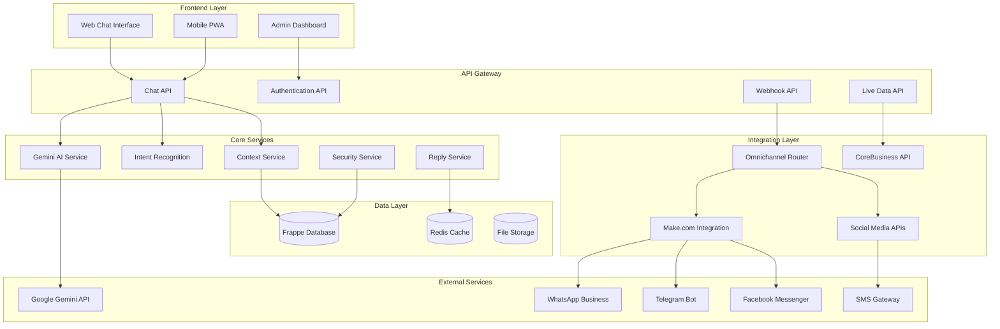
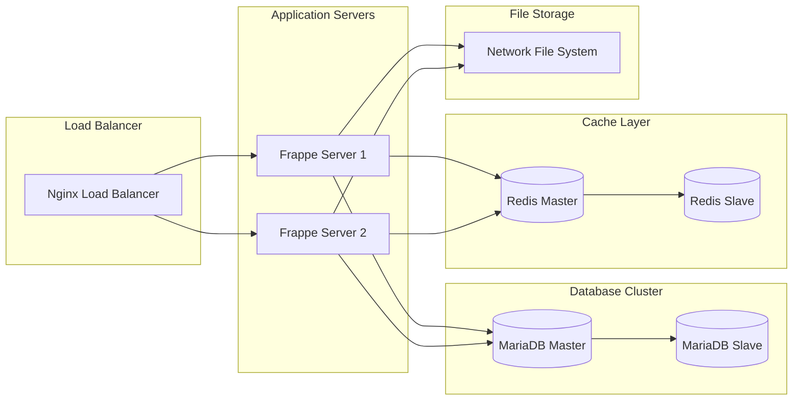

# System Architecture

This document provides a comprehensive overview of the WCFCB Assistant CRM system architecture, including core components, data flow, and integration patterns.

## High-Level Architecture

## Core Components

### 1. Frontend Layer

#### Web Chat Interface
- **Location**: `assistant_crm/public/js/chat_bubble.js`
- **Purpose**: Provides the main chat interface for web users
- **Features**:
  - Auto-launching popup with WCFCB branding
  - Real-time messaging with typing indicators
  - File upload capabilities
  - Mobile-responsive design

#### Admin Dashboard
- **Location**: `assistant_crm/www/wcfcb_dashboard.html`
- **Purpose**: Administrative interface for system management
- **Features**:
  - Real-time analytics and monitoring
  - Knowledge base management
  - User and conversation management
  - Performance metrics

### 2. API Layer

#### Chat API (`/api/method/assistant_crm.api.chat`)
- **Primary Endpoint**: `send_message`
- **Authentication**: Session-based with guest support
- **Rate Limiting**: Configurable per user/IP
- **Response Format**: JSON with message, metadata, and context

#### Authentication API
- **Service**: `enhanced_authentication_service.py`
- **Features**:
  - National ID and full name validation
  - Session management with intent locking
  - Role-based access control
  - Multi-factor authentication support

#### Live Data API
- **Service**: `live_data_integration_api.py`
- **Purpose**: Real-time data retrieval from CoreBusiness systems
- **Endpoints**:
  - Claims status and history
  - Payment information
  - Employer contribution data
  - Document status tracking

### 3. Core Services

#### Gemini AI Service
- **File**: `services/gemini_service.py`
- **Purpose**: Primary AI processing engine
- **Features**:
  - Advanced prompt engineering
  - Context-aware responses
  - Multi-language support
  - Response optimization

#### Intent Recognition Service
- **File**: `services/intent_recognition_service.py`
- **Purpose**: Classifies user messages into actionable intents
- **Supported Intents**:
  - Claims submission and tracking
  - Payment inquiries
  - Information requests
  - Service requests
  - Escalation triggers

#### Context Service
- **File**: `services/context_service.py`
- **Purpose**: Manages conversation context and user state
- **Features**:
  - Session persistence
  - User preference tracking
  - Conversation history management
  - Context-aware responses

#### Reply Service
- **File**: `services/streamlined_reply_service.py`
- **Purpose**: Orchestrates response generation
- **Flow**:
  1. Intent classification
  2. Authentication validation
  3. Live data retrieval (if needed)
  4. Response assembly
  5. Personalization and formatting

### 4. Integration Layer

#### Omnichannel Router
- **File**: `services/omnichannel_router.py`
- **Purpose**: Routes messages between different communication channels
- **Supported Channels**:
  - Web chat
  - WhatsApp Business API
  - Telegram Bot API
  - Facebook Messenger
  - SMS Gateway

#### Make.com Integration
- **File**: `api/make_com_webhook.py`
- **Purpose**: Centralized webhook handler for all social media platforms
- **Benefits**:
  - Simplified configuration
  - Unified message processing
  - Enhanced reliability
  - Easier maintenance

#### CoreBusiness Integration
- **File**: `services/corebusiness_integration_service.py`
- **Purpose**: Integration with WCFCB's core business systems
- **Features**:
  - Real-time data synchronization
  - Secure API communication
  - Data validation and transformation
  - Error handling and retry logic

## Data Architecture

### Database Schema

#### Core Tables
- **Chat History**: Conversation storage with user isolation
- **Knowledge Base Articles**: Structured content with keywords
- **User Sessions**: Session management and context
- **Intent Definitions**: Intent classification rules
- **Response Templates**: Personalized response patterns

#### Integration Tables
- **Omnichannel Messages**: Cross-platform message tracking
- **Webhook Activity Logs**: Integration monitoring
- **Live Data Cache**: Performance optimization
- **Audit Logs**: Security and compliance tracking

### Caching Strategy

#### Redis Cache Layers
1. **Session Cache**: User sessions and context (TTL: 30 minutes)
2. **Response Cache**: Frequently accessed responses (TTL: 5 minutes)
3. **Live Data Cache**: External API responses (TTL: 2 minutes)
4. **Knowledge Base Cache**: Article content (TTL: 1 hour)

## Security Architecture

### Authentication & Authorization
- **Multi-level Authentication**: Guest, authenticated, and admin levels
- **Role-Based Access Control**: Granular permissions per feature
- **Session Management**: Secure session handling with timeout
- **API Key Management**: Encrypted storage of external API keys

### Data Protection
- **Encryption**: All sensitive data encrypted at rest
- **Data Isolation**: User data segregation by role and permissions
- **Audit Logging**: Comprehensive activity tracking
- **Privacy Controls**: GDPR-compliant data handling

### Network Security
- **HTTPS Enforcement**: All communications encrypted
- **Webhook Validation**: Signature verification for external webhooks
- **Rate Limiting**: Protection against abuse and DoS attacks
- **IP Whitelisting**: Configurable access restrictions

## Performance Architecture

### Optimization Strategies
1. **Lazy Loading**: Services loaded on demand
2. **Connection Pooling**: Efficient database connections
3. **Response Caching**: Intelligent caching of AI responses
4. **Asset Optimization**: Minified and compressed frontend assets

### Monitoring & Metrics
- **Response Time Tracking**: <2 seconds for live data, <1 second for static
- **Error Rate Monitoring**: Comprehensive error tracking
- **Resource Usage**: CPU, memory, and database performance
- **User Experience Metrics**: Conversation completion rates

## Deployment Architecture

### Production Environment

### Scalability Considerations
- **Horizontal Scaling**: Multiple application server instances
- **Database Replication**: Master-slave configuration for read scaling
- **Cache Distribution**: Redis cluster for high availability
- **CDN Integration**: Static asset delivery optimization

## Integration Patterns

### Event-Driven Architecture
- **Real-time Events**: WebSocket-based real-time communication
- **Webhook Processing**: Asynchronous message handling
- **Event Sourcing**: Comprehensive audit trail
- **Message Queuing**: Reliable message delivery

### API Design Patterns
- **RESTful APIs**: Standard HTTP methods and status codes
- **Webhook Standards**: Consistent webhook payload formats
- **Error Handling**: Standardized error responses
- **Versioning**: API version management

---

**Next**: [Database Schema](database.md) | [Services Documentation](services.md)
